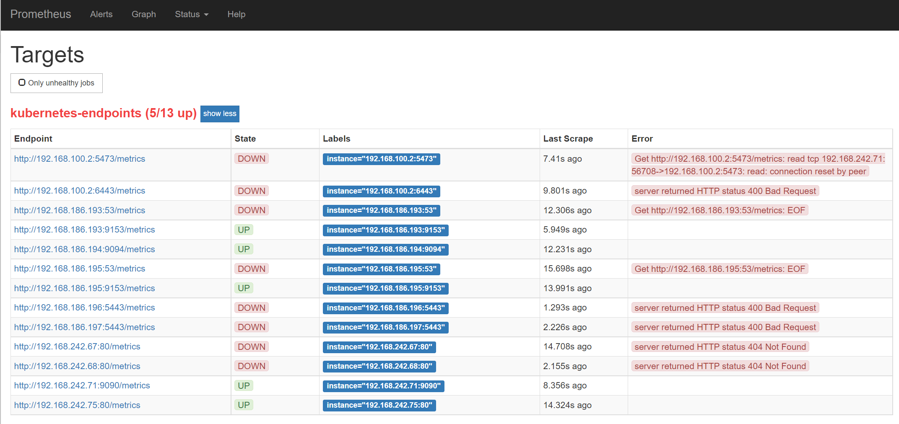
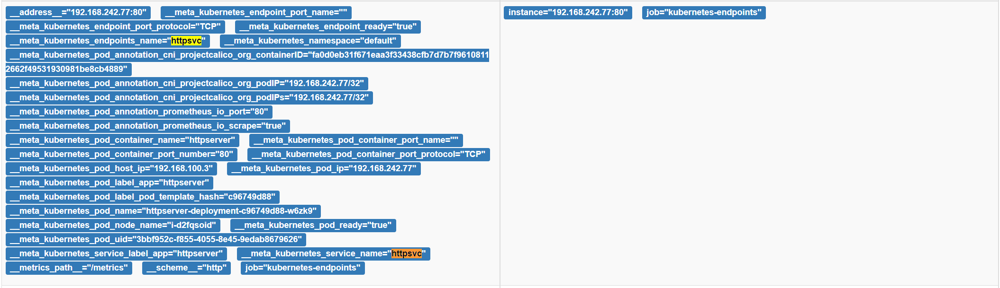

# Homework

## 练习12：以 Istio Ingress Gateway 的形式发布 httpserver 服务

> 需要考虑的几点：
>
> - 如何实现安全保证；
> - 七层路由规则；
> - 考虑 open tracing 的接入。

### 部署 httpserver v1.0

```shell
kubectl create -f configmap.yaml
kubectl create -f deployment.yaml
kubectl create -f service.yaml
```

部署成功后，查看服务

```shell
$kubectl get svc
NAME         TYPE        CLUSTER-IP       EXTERNAL-IP   PORT(S)    AGE
httpsvc      ClusterIP   10.108.244.111   <none>        8080/TCP   11s
kubernetes   ClusterIP   10.96.0.1        <none>        443/TCP    38m

$curl 10.108.244.111:8080/healthz
HTTP server is working.
```

### 下载安装 Istio

```shell
wget https://github.com/istio/istio/releases/download/1.14.1/istio-1.14.1-linux-amd64.tar.gz
tar xzvf istio-1.14.1-linux-amd64.tar.gz
```

添加解压后的路径到 PATH

```shell
export PATH=$PATH:{istio_path}/bin
```

安装 istio，Ingress gateway

```shell
$istioctl install
This will install the Istio 1.14.1 default profile with ["Istio core" "Istiod" "Ingress gateways"] components into the cluster. Proceed? (y/N) y
✔ Istio core installed
✔ Istiod installed
✔ Ingress gateways installed
✔ Installation complete  
```

查看 default namespace 可以看到 istio-system。

查看 istio-system namespace 下的 pod，可以看到 istiod 与 istio-ingressgateway pod。

```shell
$kubectl get ns
NAME               STATUS   AGE
calico-apiserver   Active   33m
calico-system      Active   46m
default            Active   63m
istio-system       Active   6m46s
kube-node-lease    Active   63m
kube-public        Active   63m
kube-system        Active   63m
tigera-operator    Active   46m

$kubectl get pod -n istio-system
NAME                                   READY   STATUS    RESTARTS   AGE
istio-ingressgateway-778f44479-gmlt9   1/1     Running   0          6m55s
istiod-6d67d84bc7-xzxbt                1/1     Running   0          8m25s
```

### 配置 Envoy Proxy 注入

为 default namespace 添加 Label

```shell
$kubectl label namespace default istio-injection=enabled
$kubectl get ns default --show-labels
NAME      STATUS   AGE   LABELS
default   Active   77m   istio-injection=enabled,kubernetes.io/metadata.name=default
```

删除 deployment，重新部署，查看 Pod 状态

```shell
$kubectl delete -f deployment.yaml
$kubectl create -f deployment.yaml
$kubectl get pod
NAME                                     READY   STATUS    RESTARTS   AGE
httpserver-deployment-64c8fd9f54-brfs7   2/2     Running   0          48s
httpserver-deployment-64c8fd9f54-t2g64   2/2     Running   0          48s
```

可以看到 httpserver 创建了 2/2 个 pod。

```shell
$kubectl describe pod httpserver-deployment-64c8fd9f54-brfs7
...
Init Containers:
  istio-init:
    Container ID:  docker://ec349a796f692f895e92aedd3a88a44e899e277931e8fd6cc66410e6d6771767
    Image:         docker.io/istio/proxyv2:1.14.1
    Image ID:      docker-pullable://istio/proxyv2@sha256:df69c1a7af7c0113424a48f5075ac6d0894123ec926fdb315e849b4f04e39616
```

查看 pod 详细信息，可以看到 Container Image 为 istio proxy，注入完成。

### 配置 Ingress Gateway 转发

编写 istio-specs.yaml

```yaml
apiVersion: networking.istio.io/v1beta1
kind: VirtualService
metadata:
  name: httpserver
spec:
  gateways:
    - httpserver 
  hosts:
    - httpserver.cncamp.io
  http:
    - match:
        - port: 80
      route:
        - destination:
            host: httpserver.httpserver.svc.cluster.local
            port:
              number: 80
---
apiVersion: networking.istio.io/v1beta1
kind: Gateway
metadata:
  name: httpserver 
spec:
  selector:
    istio: ingressgateway
  servers:
    - hosts:
        - httpserver.cncamp.io
      port:
        name: http-httpserver
        number: 80
        protocol: HTTP
```

编写 vs-pathrouting.yaml

```yaml
apiVersion: networking.istio.io/v1beta1
kind: VirtualService
metadata:
  name: httpserver
spec:
  gateways:
    - httpserver
  hosts:
    - httpserver.cncamp.io
  http:
    - match:
        - port: 80
      route:
        - destination:
            host: httpserver.httpserver.svc.cluster.local
            port:
              number: 80
```

修改 service.yaml，name 改为 httpserver。

```yaml
apiVersion: v1
kind: Service
metadata:
  labels:
    app: httpserver
  name: httpserver
spec:
  ports:
    - name: http
      port: 8080
      protocol: TCP
      targetPort: 80
  selector:
    app: httpserver
```

执行：

```shell
kubectl delete -f service.yaml
kubectl create -f service.yaml
kubectl create -f istio-specs.yaml
kubectl create -f vs-pathrouting.yaml
```

测试结果：

```shell
$kubectl get svc
NAME         TYPE        CLUSTER-IP       EXTERNAL-IP   PORT(S)    AGE
httpserver   ClusterIP   10.104.243.158   <none>        8080/TCP   17s
kubernetes   ClusterIP   10.96.0.1        <none>        443/TCP    124m

$export INGRESS_IP=10.104.243.158
curl -H "Host: httpserver.cncamp.io" $INGRESS_IP/healthz -v
*   Trying 10.104.243.158:80...
* TCP_NODELAY set

```

 <font color="red">**问题**：卡在等待中没有反馈，待解决。</font>

## 练习10-2：模拟请求 httpserver 服务延时，通过 Prometheus 监控并查询延时指标

### 更新 httpserver 模拟请求延时

在 httpserver 的 handle 请求返回时随机增加 0 ~ 2 秒的延时。

```go
// Module10: mockup delay 0-2s
func delayHandle(w http.ResponseWriter) {
	rand.Seed(time.Now().Unix())
	delay := rand.Intn(3)
	time.Sleep(time.Duration(delay) * time.Second)
}
```

重新制作镜像 httpserver:v1.1，推送镜像仓库。

### 更新 httpserver 服务

拷贝 deployment.yaml 并修改 deployment-delay.yaml

```yml
...
   spec:
      containers:
        - env:
          ...
          image: tangyouhua/httpserver:v1.1 #更新为v1.1镜像
```

更新 deployment

```shell
$kubectl apply -f deployment-delay.yaml
```

通过探活接口验证延时

```shell
$curl 10.101.69.244:8080/healthz
```

### Prometheus

#### 搭建 Prometheus

参考[在Kubernetes下部署Prometheus](https://www.prometheus.wang/kubernetes/deploy-prometheus-in-kubernetes.html)完成搭建：



#### 增加 metrics 相关配置

参考[示例 httpserver yaml](https://github.com/cncamp/101/blob/master/module10/httpserver/httpserver.yaml) 修改 deployment-delay.yaml，删除 liveness 检查。

```yaml
...
  template:
    metadata:
      annotations:
        prometheus.io/scrape: "true"
        prometheus.io/port: "80"
    ...
    spec:
      containers:
        - env:
          ...
          image: tangyouhua/httpserver:v1.1
          imagePullPolicy: IfNotPresent
          ports:
          - containerPort: 80
```

更新 deployment

```shell
$kubectl apply -f deployment-delay.yaml
```

#### 在 Prometheus 中查看 httpserver 服务



## 练习8-2：用 Service, Ingress 发布服务

### 编写 Service 脚本

service.yaml

```yaml
apiVersion: v1
kind: Service
metadata:
  labels:
    app: httpserver
  name: httpsvc
spec:
  ports:
    - port: 80
      protocol: TCP
      targetPort: 80
  selector:
    app: httpserver
  type: ClusterIP
```

发布

```shell
$kubectl get svc
NAME                        TYPE        CLUSTER-IP      EXTERNAL-IP   PORT(S)          AGE
cm-acme-http-solver-h76gd   NodePort    10.102.79.219   <none>        8089:31867/TCP   123m
httpsvc                     ClusterIP   10.104.62.222   <none>        80/TCP           17s
kubernetes                  ClusterIP   10.96.0.1       <none>        443/TCP          5h49m

$curl 10.104.62.222/healthz
HTTP server is working.
```

### 通过 Ingress 发布服务

**按照下列步骤发布遇到问题，正在解决中**

 <font color="red">**问题1**：EXTERNAL-IP 处于 **\<pending\>**。</font>

<font color="red">**问题2**：message: Issuing certificate as Secret does not exist。</font>

#### 1) 使用 helm 安装 nginx-ingress 成功

```shell
$kubectl get pod -n ingress
NAME                                       READY   STATUS    RESTARTS   AGE
ingress-nginx-controller-5756658855-wjlb8   1/1     Running   0          4h40m

$kubectl get svc -n ingress
NAME                                 TYPE           CLUSTER-IP     EXTERNAL-IP   PORT(S)                      AGE
ingress-nginx-controller             LoadBalancer   10.109.75.86   <pending>     80:31603/TCP,443:32367/TCP   4h41m
ingress-nginx-controller-admission   ClusterIP      10.96.86.230   <none>        443/TCP                      4h41m
```

 <font color="red">**问题**：EXTERNAL-IP 处于 **\<pending\>**。</font>

#### 2) 配置证书

**issuer.yaml**

```yaml
apiVersion: cert-manager.io/v1
kind: Issuer
metadata:
  generation: 1
  name: letsencrypt-prod
spec:
  acme:
    email: tangyouhua@gmail.com
    preferredChain: ""
    privateKeySecretRef:
      name: letsencrypt-prod
    server: https://acme-v02.api.letsencrypt.org/directory
    solvers:
    - http01:
        ingress:
          class: nginx
```

应用

```shell
$kubectl create -f issuer.yaml
issuer.cert-manager.io/letsencrypt-prod created

$kubectl get issuer
NAME               READY   AGE
letsencrypt-prod   True    12s

$kubectl describe issuer letsencrypt-prod
...
Message:               The ACME account was registered with the ACME server
    Observed Generation:   1
    Reason:                ACMEAccountRegistered
    Status:                True
    Type:                  Ready
```

**ingress.yaml**

```yaml
apiVersion: networking.k8s.io/v1
kind: Ingress
metadata:
  annotations:
    cert-manager.io/issuer: letsencrypt-prod
  name: httpserver
spec:
  ingressClassName: nginx
  rules:
    - host: httpserver.51.cafe
      http:
        paths:
          - backend:
              service:
                name: httpsvc
                port:
                  number: 80
            path: /
            pathType: Prefix
  tls:
    - hosts:
        - httpserver.51.cafe
      secretName: httpserver
```

应用

```shell
$kubectl create -f ingress.yaml
ingress.networking.k8s.io/httpserver created

$kubectl get ingress
NAME                        CLASS    HOSTS                ADDRESS   PORTS     AGE
cm-acme-http-solver-49vwc   <none>   httpserver.51.cafe             80        11s
httpserver                  nginx    httpserver.51.cafe             80, 443   15s

$kubectl get cert httpserver -oyaml
...
status:
  conditions:
  - lastTransitionTime: "2022-06-18T13:57:59Z"
    message: Issuing certificate as Secret does not exist
    observedGeneration: 1
    reason: DoesNotExist
    status: "True"
    type: Issuing
  - lastTransitionTime: "2022-06-18T13:57:59Z"
    message: Issuing certificate as Secret does not exist
    observedGeneration: 1
    reason: DoesNotExist
    status: "False"
    type: Ready
  nextPrivateKeySecretName: httpserver-stgcr
```

<font color="red">**问题**：message: Issuing certificate as Secret does not exist。</font>

## 练习8-1：编写 httpserver 部署脚本

deploy.yaml, configmap.yaml

### 部署脚本

- 建立部署 httpserver-deployment
- 实例数：3
- 设置 Rolling 策略
- 配置实例模板
  - 拉取 docker hub 上的镜像：tangyouhua/httpserver:v1.0
  - 配置资源
  - 通过 HTTP 80 端口 healthz API 实现探针


```yaml
apiVersion: apps/v1
kind: Deployment
metadata:
  labels:
    app: httpserver
  name: httpserver-deployment
spec:
  progressDeadlineSeconds: 600
  replicas: 3
  revisionHistoryLimit: 5
  selector:
    matchLabels:
      app: httpserver
  strategy:
    rollingUpdate:
      maxSurge: 30%
      maxUnavailable: 30%
    type: RollingUpdate
  template:
    metadata:
      creationTimestamp: null
      labels:
        app: httpserver
    spec:
      containers:
        - env:
          - name: httpport
            valueFrom:
              configMapKeyRef:
                key: httpport
                name: httpserver-env
          image: tangyouhua/httpserver:v1.0
          imagePullPolicy: IfNotPresent
          livenessProbe:
            failureThreshold: 3
            httpGet:
              path: /healthz
              port: 80
              scheme: HTTP
            initialDelaySeconds: 5
            periodSeconds: 10
            successThreshold: 1
            timeoutSeconds: 1
          name: httpserver
          readinessProbe:
            failureThreshold: 3
            httpGet:
              path: /healthz
              port: 80
              scheme: HTTP
            initialDelaySeconds: 5
            periodSeconds: 10
            successThreshold: 1
            timeoutSeconds: 1
          resources:
            limits:
              cpu: 500m
              memory: 500Mi
            requests:
              cpu: 50m
              memory: 100Mi
          terminationMessagePath: /dev/termination.log
          terminationMessagePolicy: File
      dnsPolicy: ClusterFirst
      #imagePullSecrets:
      #  - name: cloudnative
      restartPolicy: Always
      schedulerName: default-scheduler
      securityContext: {}
      terminationGracePeriodSeconds: 60
```

### configmap.yaml

使用 ConfigMap 定义 httpserver 端口与日志级别。

- 端口 80
- 日志级别 warn

```yaml
apiVersion: v1
kind: ConfigMap
metadata:
  name: httpserver-env
data:
  httpport: "80"
  loglevel: "warn"
```

### 部署结果摘选

```shell
Name:                   httpserver-deployment
Labels:                 app=httpserver
Annotations:            deployment.kubernetes.io/revision: 1
Selector:               app=httpserver
Replicas:               3 desired | 3 updated | 3 total | 3 available | 0 unavailable
StrategyType:           RollingUpdate
RollingUpdateStrategy:  30% max unavailable, 30% max surge
Pod Template: ...
```

### Pod 信息摘选

```shell
Name:         httpserver-deployment-64c8fd9f54-c5s56
Labels:       app=httpserver
              pod-template-hash=64c8fd9f54
Containers:
  httpserver:
    Image:          tangyouhua/httpserver:v1.0
    Limits:
      cpu:     500m
      memory:  500Mi
    Requests:
      cpu:      50m
      memory:   100Mi
    Liveness:   http-get http://:80/healthz delay=5s timeout=1s period=10s #success=1 #failure=3
    Readiness:  http-get http://:80/healthz delay=5s timeout=1s period=10s #success=1 #failure=3
    Environment:
      httpport:  <set to the key 'httpport' of config map 'httpserver-env'>  Optional: false
    Mounts:
      /var/run/secrets/kubernetes.io/serviceaccount from kube-api-access-6688g (ro)
Conditions:
  Type              Status
  Initialized       True
  Ready             True
  ContainersReady   True
  PodScheduled      True
QoS Class:                   Burstable
Events:
  Type    Reason     Age   From               Message
  ----    ------     ----  ----               -------
  Normal  Scheduled  16m   default-scheduler  Successfully assigned default/httpserver-deployment-64c8fd9f54-c5s56 to k8snode1
  Normal  Pulled     15m   kubelet            Container image "tangyouhua/httpserver:v1.0" already present on machine
  Normal  Created    15m   kubelet            Created container httpserver
  Normal  Started    15m   kubelet            Started container httpserver
```

**思考点**

- 优雅启动：对启动有依赖项或者启动条件要求时，可采用 [postStart Container Hook][1] 或者配置 [Init Container][2] 提供支持。
- 优雅终止：在退出容器时，需要进行后续处理，可采用 [preStop Container Hook][1] 提供支持。同时，为了确保 `preStop` 可能出现的挂起情况，使用 `terminationGracePeriodSeconds` 保证退出。
- 资源需求和 QoS 保证：针对应用的具体情况，对 Pod 和 Container 资源进行管理，[为 memory, cpu 等资源指定 resources, requests, limits][3]。学习理解 [Guaranteed, Burstable, BestEffort 三个 QoS 等级的资源配置方法][4]。
- 探活：通过 [liveness HTTP request][5] 对 httpServer `/healthz` 接口探活。
- 日常运维需求，日志等级：配置日志等级参数。
- 配置和代码分离：使用 [configmap][6]。

[1]: https://kubernetes.io/docs/concepts/containers/container-lifecycle-hooks/
[2]: https://kubernetes.io/docs/tasks/configure-pod-container/configure-pod-initialization/
[3]: https://kubernetes.io/docs/concepts/configuration/manage-resources-containers/
[4]: https://kubernetes.io/docs/concepts/configuration/manage-resources-containers/
[5]: https://kubernetes.io/docs/tasks/configure-pod-container/configure-liveness-readiness-startup-probes/
[6]: https://kubernetes.io/docs/concepts/configuration/configmap/

## 练习1, 2：编写 HTTP 服务器，制作镜像

### 要求

1. 接收客户端 request，并将 request 中带的 header 写入 response header
2. 读取当前系统的环境变量中的 VERSION 配置，并写入 response header
3. Server 端记录访问日志包括客户端 IP，HTTP 返回码，输出到 server 端的标准输出
4. 当访问 localhost/healthz 时，应返回 200
5. 构建本地镜像
6. 推送镜像到 Docker Hub
7. 通过 docker 本地命令启动 httpserver
8. 通过 nsenter 进入容器查看 IP 地址

### 运行

```shell
# 宿主机
$ docker run -p 8080:80 -d tangyouhua/httpserver:v1.0 # 映射 httpserver 到本地 8080 端口
$ curl localhost:8080/healthz #查看服务
HTTP server is working.
$ docker inspect <container id> -f '{{.State.Pid}}'
9337
$ sudo nsenter -n -t9937
root# ip addr
1: lo: <LOOPBACK,UP,LOWER_UP> mtu 65536 qdisc noqueue state UNKNOWN group default qlen 1000
    link/loopback 00:00:00:00:00:00 brd 00:00:00:00:00:00
    inet 127.0.0.1/8 scope host lo
       valid_lft forever preferred_lft forever
46: eth0@if47: <BROADCAST,MULTICAST,UP,LOWER_UP> mtu 1500 qdisc noqueue state UP group default
    link/ether 02:42:ac:11:00:02 brd ff:ff:ff:ff:ff:ff link-netnsid 0
    inet 172.17.0.2/16 brd 172.17.255.255 scope global eth0
       valid_lft forever preferred_lft forever
```

## 镜像

- golang 1.17 镜像：https://hub.docker.com/_/golang/
- busybox 1.34 镜像：<https://hub.docker.com/_/busybox>
- tangyouhua/httpserver:v1.0 镜像：<https://hub.docker.com/repository/docker/tangyouhua/httpserver>
